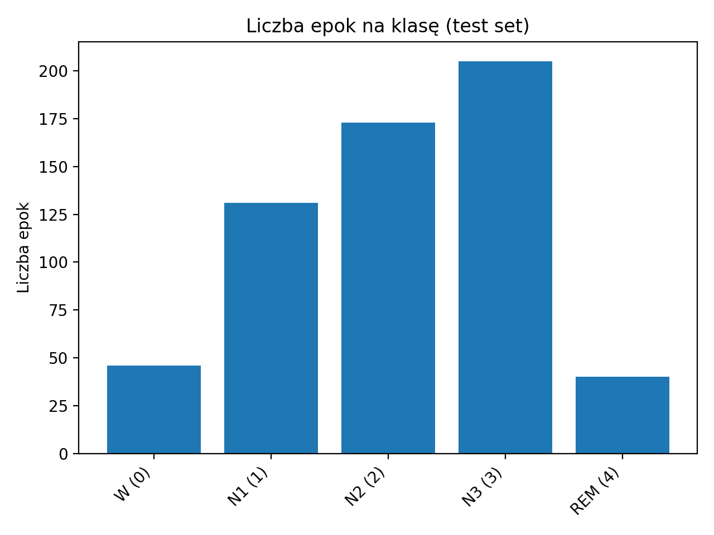
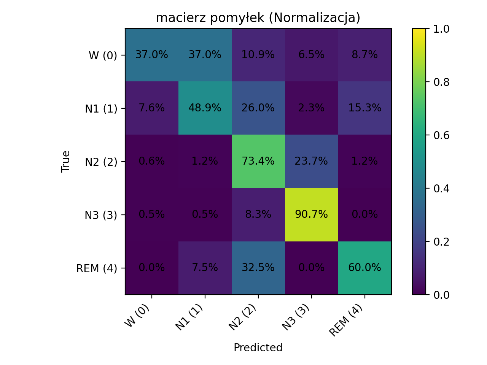
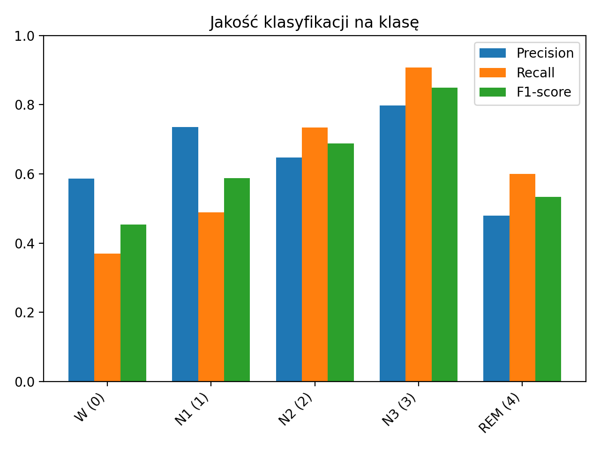

# Sleep Stage Classification from EEG

Bachelor engineering project focused on automatic sleep stage classification using EEG signals and machine learning.

## Overview

The goal of this project was to evaluate how a simple K-Nearest Neighbors (KNN) model performs in classifying sleep stages based on EEG recordings.

The model was trained on PSG and hypnogram EDF recordings from the Sleep-EDF dataset. Signal preprocessing included filtering, segmentation into 30-second epochs, and spectral feature extraction using Welch’s method.

To reduce data leakage between train and test sets, GroupShuffleSplit was used based on 16 different nights/patients.

## Sleep stages

The model classifies 5 sleep stages:

- Wake (W)
- N1
- N2
- N3
- REM

## Pipeline

1. Load EDF signals and annotations  
2. Filter EEG signals (0.5–30 Hz)  
3. Split signals into 30-second epochs  
4. Extract spectral and statistical features  
5. Train KNN model  
6. Evaluate model performance  

## Technologies

- Python
- MNE
- NumPy
- SciPy
- Scikit-learn
- Matplotlib

## Results

The k-NN classifier achieved:

- Accuracy: 72%
- Balanced Accuracy: 64.65%

Example model evaluation:

### Class distribution

### Normalized confusion matrix

### Precision / Recall / F1-score

The model performed best on deep sleep (N3) and showed lower performance on transitional stages such as N1 and REM, which is consistent with the complexity of sleep stage boundaries.

## Dataset

Sleep-EDF Expanded Dataset (PhysioNet)

Dataset files are not included in this repository.
Download Sleep-EDF Expanded from PhysioNet and place them inside the `data/` directory.

## Author

Piotr Idec
